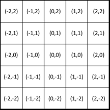

# Localisation De Cible

## Enoncé

Vous allez recevoir une matrice de N × N valeurs. Vous devrez indiquer les coordonnées (colonne, ligne) notées ci-après (X, Y) de la valeur maximale. En cas d’égalité de plusieurs valeurs, vous devez choisir la case (X, Y) dont la distance au centre du carré est la plus petite. Les matrices générée seront telle qu'il n'y aura jamais deux valeurs maximales équidistantes du centre du carré.
N est toujours impaire. L’abscisse et l’ordonnée d’un point sont mesurés par des valeurs positives ou négatives par rapport au centre comme montré ci-dessous.

Par conséquent la distance par rapport au centre d’un point (X,Y) est égale à Racine carrée de (X^2 + Y^2).

## Format des données

### Entrée
La première ligne contient le nombre entier impaire strictement positif correspondant à la taille de la matrice. Les N lignes suivantes contiennent chacune les N nombres entiers en notation décimale, séparés par le caractère "espace". Ces N lignes de N nombres forment la matrice. La première colonne (premier nombre de chaque ligne) correspond à l’abscisse -(N-1)/2, la dernière colonne (dernier nombre de chaque ligne) correspond à l’abscisse (N-1)/2. La première ligne correspond à l’ordonnée (N-1)/2 et la dernière ligne à l’ordonnée -(N-1)/2.

### Sortie
Deux nombres entiers en notation décimale séparés par le caractère "espace", le premier étant l’abscisse (colonne) et le deuxième l’ordonnée (ligne) de la plus grande valeur.

