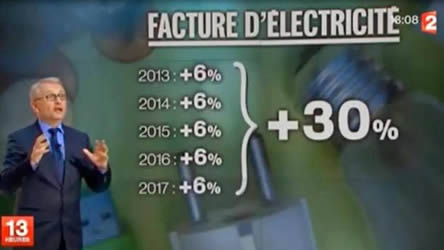

# 2.TV

## Énoncé

L'année scolaire étant terminée, vous êtes en vacances chez votre grand-mère dans l'Ariège. Il n'y a même pas Internet, c'est terrible.

Premier réflexe, allumer la télé. Là, vous tombez sur l'émission suivante :

Vous n'êtes pas dupe. Vous savez bien que si un montant augmente de 6 % chaque année pendant 5 ans, alors il augmentera au total de 33,82 %. Un autre exemple : si un objet vaut 100 et qu'il augmente de 10% chaque année, il vaudra 110 au bout d'un an, puis s'il augmente à nouveau de 10%, il vaudra 121. Donc l'augmentation sur 2 ans sera de 21%.

Vous aimeriez programmer un script pour généraliser ce calcul de l'augmentation globale, afin d'expliquer à votre grand-mère qu'elle doit faire attention à ce qui est dit à la télé.

## Format des données

### Entrée

Ligne 1 : deux entiers T et D représentant respectivement le pourcentage d'augmentation par an et la durée en années. T est compris entre 1 et 100 et D entre 1 et 8.

### Sortie

Un nombre décimal arrondi à deux chiffres après la virgule, obtenu en considérant le taux de croissance sur le nombre d'années donné (par exemple 21.00 dans le cas d'une augmentation de 10% sur 2 ans).