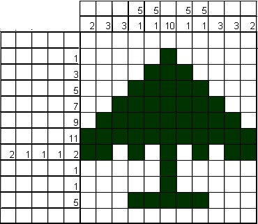
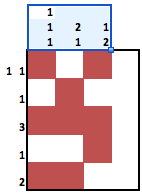

# 3.Scrabble

## Enoncé

Après avoir intégré votre algorithme précédent dans une application installée dans l'iPhone de votre grand-mère, vous perdez un peu d'intérêt pour ce jeu. En feuilletant un magazine, vous tombez sur un logigraphe.

Il s'agit d'une grille logique où en lignes et en colonnes, on dispose du nombre de cases à noircir consécutivement. Par exemple, 4-2 signifie qu'il y a un bloc de 4 cases puis un bloc de 2 cases à noircir sur cette ligne. Idem en colonnes. Dans ce problème, il ne s'agit pas de résoudre un logigraphe, mais d'en construire une grille pour un dessin donné.

### Format des données

__Entrée__
Ligne 1 : deux entiers N et M séparés par des espaces, représentant la hauteur et la largeur du dessin.

Lignes 2 à N + 1 : une ligne composée de M caractères . (case blanche) et x (case noircie), représentant une ligne du dessin.

__Sortie__
Les N+M instructions du logigraphe séparées par des espaces.

Chaque instruction est de la forme b1-b2-…-bk où les bi sont des entiers représentant le nombre de cases à noircir (dans le bon ordre).

L'ordre des instructions correspond aux N lignes puis aux M colonnes. Quand une instruction est vide utilisez la chaîne ".".

Exemple : pour le logigraphe suivant,

Votre code doit renvoyer 1-1 1 3 1 2 1-1-1 2-1 1-2 .