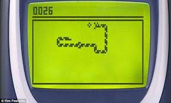
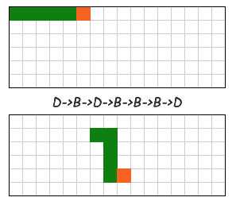

# 2.Snake (Phase 1)
  
**Enoncé**  

Sur les premiers téléphones, on trouvait le jeu du serpent. Pour simplifier on va considérer que le serpent se promène simplement et qu'il conserve toujours la même longueur.  

Le serpent ne peut pas faire marche arrière s'il fait un mouvement dans un sens, il ne peut pas faire juste après un mouvement dans le sens opposé. Le serpent ne peut pas non plus se mordre, c'est à dire qu'après un mouvement, sa tête ne peut pas être sur une partie de son corps.  

Le but de ce challenge est de déterminer où se trouve la queue du serpent après une série de mouvements.  

Exemple : le serpent part de la position horizontale (figure du haut), sa tête fait le mouvement Droite->Bas->Droite->Bas->Bas->Bas->Droite. Il va se retrouver dans la position de la figure du bas. Si l'on considère que la coordonnée en haut à gauche est (0,0), la queue se trouvera alors en (6,1).  
  

**Format des données**  

__Entrée__  
Ligne 1 : un entier **N** entre _2_ et _50_ représentant la taille du serpent. On suppose que le serpent part de la position horizontale, il s'étale donc entre la position (0,0) et la position (**N**-1,0)  
Ligne 2 : un entier **P** compris entre 1 et 500 représentant le nombre de mouvements de la tête du serpent.  
Ligne 3 à **P** +2 : une lettre majuscule comprise dans _D, G, H, B_ pour représenter un mouvement de la tête du serpent (Droite, Gauche, Haut, Bas). Le serpent ne sortira jamais du cadre et la tête du serpent ne peut pas se déplacer vers une case qui serait occupée par une partie de son corps après le mouvement.  

__Sortie__  
Deux entiers séparés par un espace représentant la position finale de la queue du serpent. La première coordonnée est la coordonnée horizontale et la seconde coordonnée est la position verticale. Dans l'exemple ci-dessus, la sortie doit être 6 1.  
